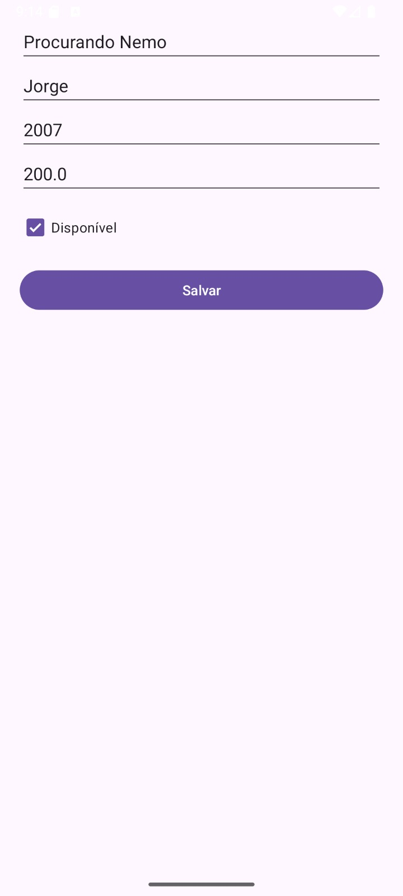
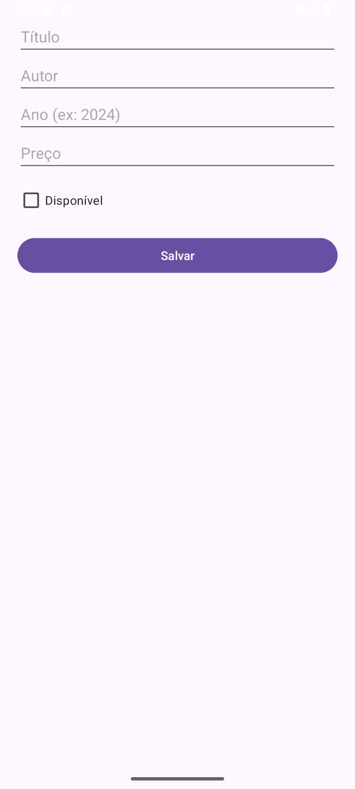
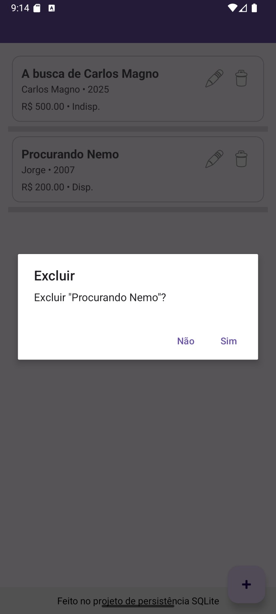

📚 Gerenciador de Livros – Android + SQLite
📖 Descrição

Aplicativo Android desenvolvido em Java utilizando SQLite para persistência de dados locais.
Permite o cadastro, edição, listagem e exclusão de livros, servindo como exemplo prático do uso da arquitetura em camadas (Model – DAO – UI) no Android.

🚀 Funcionalidades

Listagem de livros em uma ListView.

Inserção de novos registros através de formulário.

Edição de livros já cadastrados.

Exclusão de livros com confirmação via diálogo.

Persistência de dados em banco local SQLite.

Interface estilizada com Material Design:

Toolbar (navbar) com título do app

Footer informativo

Floating Action Button (FAB) para adicionar livros

Itens da lista exibidos em cards com botões de editar e excluir

📂 Layouts (res/layout)

activity_main.xml → Tela principal (ListView, Toolbar, Footer, FAB)

activity_livro_form.xml → Tela de formulário de cadastro/edição

item_livro.xml → Layout dos itens da lista

🗃 Modelo de Dados
Classe Livro

id (long)

titulo (String)

autor (String)

anoPublicacao (int)

preco (double)

disponivel (boolean)

Operações no SQLite

Inserir novo livro

Atualizar livro existente

Excluir livro

Listar todos os livros

📸 Telas do App
### Tela Principal

### Tela Principal

### Formulário de Cadastro/Edição

### Lista de Livros com Ações

Tela Principal: Lista de livros, FAB para adicionar.

Formulário: Campos de título, autor, ano, preço e checkbox de disponibilidade.

Ações: Botões de editar e excluir em cada item.

(adicione prints quando rodar o app no emulador/celular)

⚙️ Tecnologias Utilizadas

Java 8+

Android SDK

SQLite

Material Design Components

📦 Como Executar

Clone este repositório:

Abra o projeto no Android Studio.

Construa e rode em um emulador Android ou dispositivo físico.

👨‍💻 Autor

Projeto desenvolvido por Artur Mineiro🎓
Disciplina: Persistência de Dados em Aplicativos Móveis – AVA 2

📚 Licença

Este projeto é apenas para fins educacionais/acadêmicos.